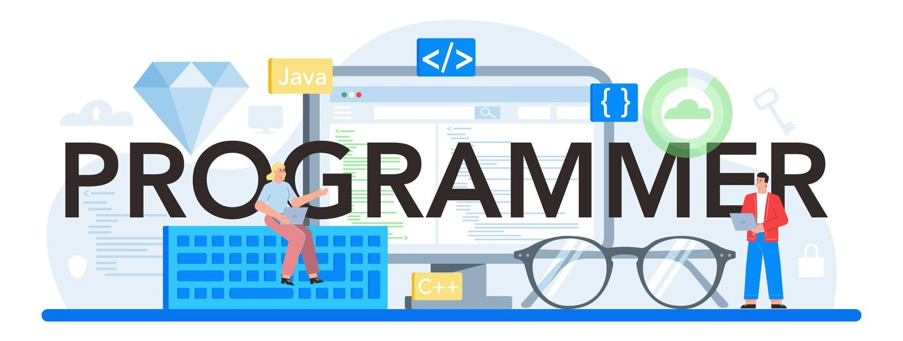

# Devossian 동아리

> *"코딩을 통한 창의적 혁신, Devossian과 함께!"*

조선대학교 Devossian 동아리는 개발과 소프트웨어에 대한 열정을 가진 학생들이 모여 다양한 프로젝트와 스터디를 진행하는 동아리입니다.

## 목차
- [소개](#소개)
- [프로젝트](#프로젝트)
- [가입조건](#가입조건)

## 소개
Devossian 동아리는 **창의적 문제 해결**, **협업** 그리고 **지속적인 학습**을 추구합니다.  
우리의 목표는 최신 개발 기술을 익히고, 실제 프로젝트를 통해 실력을 향상시키며, 동아리원 간의 네트워킹을 강화하는 것입니다.

## 프로젝트
- **Project Alpha:** Devossian 동아리 사이트 제작
- **Project Beta:** 조선대학교 학생용 클라우드 시스템 구축
- **Project Gamma:** 조선대학교 학습 보조 프로그램 LMS 구축

더 자세한 정보는 각 프로젝트 폴더 내의 `README.md` 파일을 참고하세요.

## 가입조건
- 1회 이상의 프로젝트 경험
- 1개 이상의 프로그래밍 언어 능력
- 1개 이상의 프레임 워크 개발 경험

